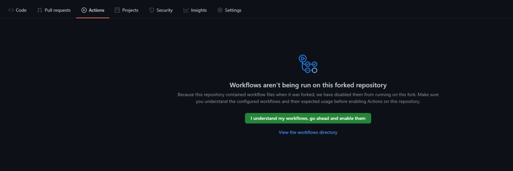

## Задание 1. Обратное распространение ошибок.

### Описание
В этом задании вам необходимо реализовать на Python/Numpy упрощенные версии нескольких стандартных слоев нейросети, которые можно встретить в любом DL-фреймворке:
* [ReLu](https://pytorch.org/docs/stable/generated/torch.nn.ReLU.html)
* [MaxPool](https://pytorch.org/docs/stable/generated/torch.nn.MaxPool2d.html)
* [Linear](https://pytorch.org/docs/stable/generated/torch.nn.Linear.html)
* [Cross Entrpopy](https://pytorch.org/docs/stable/generated/torch.nn.LogSoftmax.html#torch.nn.LogSoftmax)
* [Conv](https://pytorch.org/docs/stable/generated/torch.nn.Conv2d.html)

Для всех слоев в пакете есть заготовки, имеющие общий интерфейс [BaseLayer](../task1/a4_course_cvdl_t1/base.py). Ваша задача - для каждого слоя реализовать конструктор `.__init__`, методы `.forward` и `.backward`. Все слои в своем поведении максимально близки к PyTorch.

### Тестирование
К пакету прилагаются авто-тесты, в которых проверяются результаты работы каждого слоя в следующем порядке:
* метод `__init__()`: создание слоя (тензоры для параметров `.parameters` и градиентов параметров `.parameters_grads`)
* результат метода `.forward()`: "прямой прогон" слоя
* результат метода `.backward()`: обратное распространение градиента
* аттрибут слоя `.parameters_grads`: градиенты параметров

Количество тестов разное для каждого слоя, соразмерно его сложности.

#### Локальный запуск тестов
1. Сделать [форк репо](https://docs.github.com/en/get-started/quickstart/fork-a-repo) в свой Github
2. Склонить репо на свою машину
```
    $ git clone <your repo>
```
3. Установить пакет:
```
    $ cd a4_course_cvdl
    $ pip install -e task1
```
4. Запустить тесты
```
    pytest --pyargs a4_course_cvdl_t1

```
5. (Опционально) Запустить тесты до первой ошибки
```
    pytest --pyargs a4_course_cvdl_t1 -x

```
6. (Опционально) Запустить тесты определенного слоя
```
    pytest --pyargs a4_course_cvdl_t1.tests.test_relu

```


#### Github-Actions запуск тестов
Подготовка репозитория
1. Сделать [форк репо](https://docs.github.com/en/get-started/quickstart/fork-a-repo) в свой Github
2. Зайти в раздел actions, нажать зелёную кнопку "I understand my workflows, go ahead and enable them"



После этого на каждый коммит будут автоматически запускаться тесты, и вы сможете в подготовленном репозитории:
1. Написать код, сделать коммит, запушить в свой репо
2. Открыть и посмотреть результаты в Github Actions (https://github.com/<you>/<your_repo>/actions) раздел `Task1 eval full` - в нём прогоняются все тесты и выводится доля пройденных тестов
2. (Опционально) Открыть и посмотреть результаты в Github Actions раздел `Task1 eval failfast` - в нём тесты останавливаются после первой ошибки


### Оценка и условия
`Балл` = floor(`доля пройденных тестов` * `максимум баллов за задание`).

`Доля пройденных тестов` определяется по прогону тестов через GithubAction в вашем форке в ветке master (`Task1 eval full`)

Сроки сдачи:
- В срок [12.09 – 3.10], `максимум баллов за задание` = 20
- Начиная с 3.10, `максимум баллов за задание` = 10
- Начиная с 18.12, баллы за задание не начисляются

Ваш итоговый `Балл` - максимальный из когда-либо набранных за один прогон тестов.

Требования к реализации:
- должны использоватьcя только Python и numpy
- можно менять только код модулей слоев - нельзя менять тесты, нельзя менять setup.py, base.py, workflow
- нельзя бездумно копировать чужой код (у других студентов или из интернетов)
